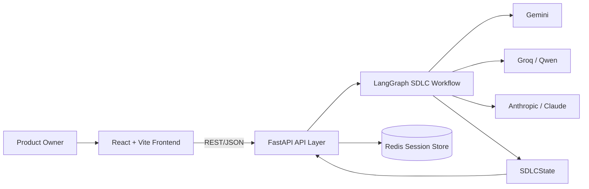
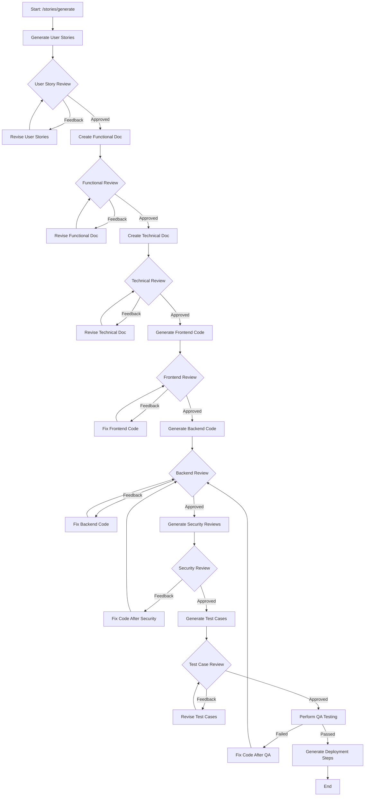

# SDLC Copilot

SDLC Copilot is a full-stack AI-assisted workflow system that drives a software project through major SDLC stages using a **stateful LangGraph pipeline** and **human approvals at review checkpoints**.

It is composed of:
- A **FastAPI backend** that orchestrates workflow execution, state transitions, and session persistence.
- A **React frontend** that presents phase artifacts and collects approval/feedback.
- **LLM-backed phase nodes** (Gemini, Groq/Qwen, Anthropic) for generation and revision.
- **Redis session storage** for API-facing state continuity.

---

## Table of Contents
- [Core capabilities](#core-capabilities)
- [Architecture](#architecture)
  - [System architecture drawing](#system-architecture-drawing)
  - [Workflow architecture drawing](#workflow-architecture-drawing)
- [How the workflow works](#how-the-workflow-works)
- [Backend architecture deep dive](#backend-architecture-deep-dive)
  - [Runtime model](#runtime-model)
  - [State contract (`SDLCState`)](#state-contract-sdlcstate)
  - [Graph topology and branching](#graph-topology-and-branching)
  - [API endpoints](#api-endpoints)
- [Frontend architecture deep dive](#frontend-architecture-deep-dive)
- [Repository structure](#repository-structure)
- [Setup and run](#setup-and-run)
- [Configuration](#configuration)
- [Current limitations / implementation notes](#current-limitations--implementation-notes)
- [Suggested next improvements](#suggested-next-improvements)

---

## Core capabilities

SDLC Copilot covers these implemented phases:
1. Requirements intake
2. User stories generation + owner review
3. Functional design generation + owner review
4. Technical design generation + owner review
5. Frontend code generation + owner review
6. Backend code generation + owner review
7. Security review + optional backend fix loop
8. Test case generation + owner review
9. QA testing + optional backend fix loop
10. Deployment steps generation

The workflow is **not single-shot**; it is **iterative**, and phase transitions are driven by explicit review outcomes.

---

## Architecture

### System architecture drawing



### Workflow architecture drawing



---

## How the workflow works

1. Frontend submits requirements to `POST /stories/generate`.
2. Backend creates a session (`session_id`), starts LangGraph execution, and persists session payload in Redis.
3. Execution pauses before configured review nodes (`interrupt_before`) and waits for owner input.
4. Owner submits either:
   - `approved` → graph advances to next phase.
   - textual feedback → graph routes to revise/fix node and re-enters review.
5. This repeats through design, code, security, tests, QA, and deployment.

This model gives deterministic phase gating with resumable state.

---

## Backend architecture deep dive

### Runtime model

`backend/app.py` builds shared app state on startup:
- Redis client
- async HTTP client
- compiled `SDLCGraphBuilder` workflow

The API layer then:
- validates request sequence (`session_validator`),
- reads/writes session payloads in Redis,
- updates LangGraph thread state and streams forward execution,
- returns phase-specific DTOs from `responses.py`.

### State contract (`SDLCState`)

`SDLCState` is the canonical graph state and includes:
- requirements and artifact payloads (stories/docs/code/reviews/tests/qa/deployment),
- message histories for each phase,
- phase status fields,
- revision count for iterative loops.

This keeps all phase data in one typed contract across nodes.

### Graph topology and branching

`SDLCGraphBuilder` registers nodes for each SDLC step and wires:
- linear forward edges for normal progression,
- conditional edges for approved vs feedback paths,
- remediation loops from Security/QA back into backend review path.

Review nodes are interruption boundaries, enabling human-in-the-loop orchestration.

### API endpoints

| Stage | Endpoint | Method | Purpose |
|---|---|---|---|
| Health | `/health` | GET | Health payload |
| Health | `/status` | GET | Server status model |
| User stories | `/stories/generate` | POST | Start session and generate user stories |
| User stories | `/stories/review/{session_id}` | POST | Approve/revise stories |
| Functional doc | `/documents/functional/generate/{session_id}` | POST | Get generated functional doc |
| Functional doc | `/documents/functional/review/{session_id}` | POST | Approve/revise functional doc |
| Technical doc | `/documents/technical/generate/{session_id}` | POST | Get generated technical doc |
| Technical doc | `/documents/technical/review/{session_id}` | POST | Approve/revise technical doc |
| Frontend code | `/code/frontend/generate/{session_id}` | POST | Get generated frontend code |
| Frontend code | `/code/frontend/review/{session_id}` | POST | Approve/revise frontend code |
| Backend code | `/code/backend/generate/{session_id}` | POST | Get generated backend code |
| Backend code | `/code/backend/review/{session_id}` | POST | Approve/revise backend code |
| Security | `/security/review/get/{session_id}` | GET | Get security findings |
| Security | `/security/review/review/{session_id}` | POST | Approve/fix-after-review flow |
| Test cases | `/test/cases/get/{session_id}` | GET | Get test cases |
| Test cases | `/test/cases/review/{session_id}` | POST | Approve/revise test cases |
| QA | `/qa/testing/get/{session_id}` | GET | Get QA testing report |
| Deployment | `/deployment/get/{session_id}` | GET | Get deployment steps |

---

## Frontend architecture deep dive

The frontend is phase-oriented and route-driven:
- `/` (`Home.tsx`): requirements form and session bootstrap.
- `/sdlc` (`SDLC.tsx`): workspace with sidebar phase selector + active phase panel + chat approval bar.

Key behavior:
- `ChatInterface.tsx` maps selected phase to backend review endpoint.
- "Approve & Continue" posts `{ feedback: "approved" }`.
- Custom feedback posts free text for revise/fix paths.
- `completedPhases` controls lock/unlock UI state in `SDLCPhaseSelector.tsx`.

---

## Repository structure

```text
PairProgramer/
├── backend/
│   ├── app.py                      # FastAPI entrypoint
│   ├── workflow_test.py            # Manual end-to-end workflow exerciser
│   ├── requirements.txt
│   └── src/sdlccopilot/
│       ├── graph/sdlc_graph.py     # LangGraph topology + compilation
│       ├── nodes/                  # Per-phase node logic
│       ├── helpers/                # LLM helper abstractions
│       ├── prompts/                # Prompt templates
│       ├── states/                 # Pydantic state models
│       ├── llms/                   # LLM provider wrappers
│       ├── requests.py             # Request DTOs
│       └── responses.py            # Response DTOs
├── frontend/
│   ├── src/pages/                  # Home, SDLC workspace
│   ├── src/phases/                 # Phase views
│   ├── src/components/             # Reusable UI components
│   ├── src/types.ts
│   └── config.ts                   # VITE_BACKEND_URL binding
└── notebooks/                      # Prompt/prototype exploration
```

---

## Setup and run

### Prerequisites
- Python 3.10+
- Node.js 18+
- Redis

### Backend
```bash
cd backend
python -m venv .venv
source .venv/bin/activate
pip install -r requirements.txt
uvicorn app:app --host 0.0.0.0 --port 8000 --reload
```

### Frontend
```bash
cd frontend
npm install
npm run dev
```

Open:
- Frontend: `http://localhost:5173`
- API docs: `http://localhost:8000/docs`

---

## Configuration

### Backend environment variables

Typical required variables:
- `PROJECT_ENVIRONMENT` (`development` enables mocked constants in many nodes)
- `REDIS_HOST`, `REDIS_PORT`, `REDIS_PASSWORD`
- `GROQ_API_KEY`
- `ANTHROPIC_API_KEY`
- `GEMINI_API_KEY`
- `GOOGLE_API_KEY`
- `LANGSMITH_API_KEY`, `LANGSMITH_PROJECT`, `LANGSMITH_TRACING`

### Frontend environment variables

`frontend/.env`:
```env
VITE_BACKEND_URL=http://localhost:8000
```

---

## Current limitations / implementation notes

- Deployment and maintenance appear in frontend phase list, but backend currently exposes deployment retrieval only and no maintenance pipeline.
- Several nodes contain development-mode constants and simulated waits to support local demo runs.
- Session persistence is split between LangGraph checkpoint memory and Redis API cache.
- This repository includes notebook/prototyping assets in addition to the app runtime code.

---

## Suggested next improvements

- Add automated integration tests for full phase transition matrix.
- Align QA response rendering and shape contracts end-to-end.
- Move from in-memory checkpointer to persistent checkpointer backend.
- Add authentication and ownership checks for `session_id` access.
- Add retry/backoff and observability around LLM calls.
