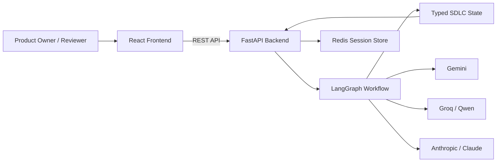
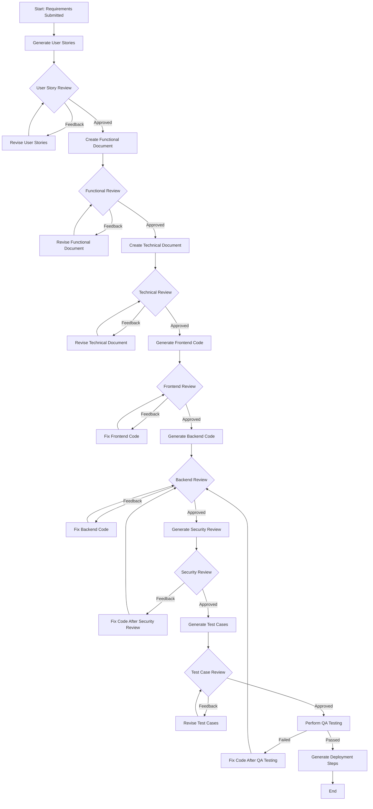
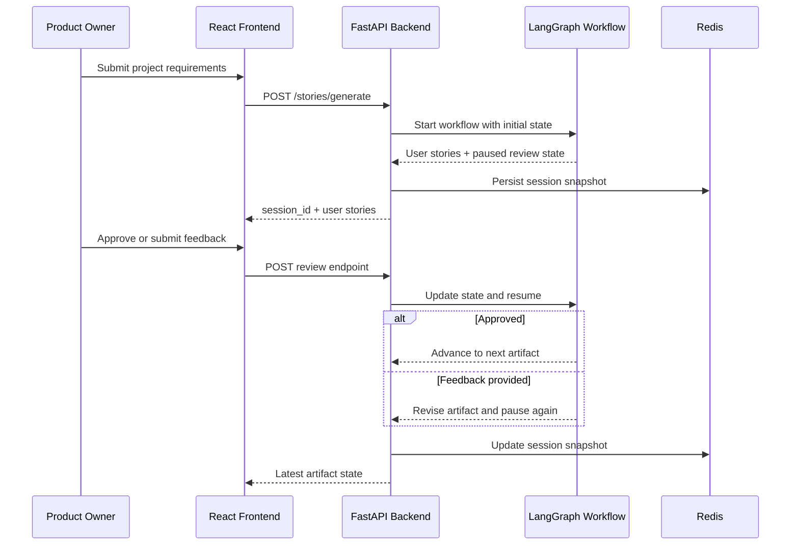

# PairProgramer

**Author:** DevDesai-444

PairProgramer is an AI-assisted software delivery system that turns a rough product idea into progressively refined SDLC artifacts through a human-in-the-loop workflow. Instead of treating software generation as a single prompt-response event, this project models delivery as a gated pipeline: requirements become user stories, stories become design documents, design becomes code, code goes through security and QA review, and only then does the system produce deployment guidance.

The core idea is simple: strong software outcomes come from structured iteration, not just generation. This repository demonstrates that belief with a full-stack implementation built around a stateful LangGraph workflow, a FastAPI orchestration layer, and a React interface for artifact review and approval.


## Executive Summary

Most AI coding demos optimize for a flashy first draft. PairProgramer is designed around a more realistic engineering question:

**Can we use multiple LLMs inside a controlled workflow to support the full software development life cycle while preserving human oversight at every major decision boundary?**

This repository answers that question with a practical prototype that:

- accepts project requirements from a frontend UI,
- generates user stories, functional documents, technical documents, frontend code, backend code, security findings, test cases, QA results, and deployment steps,
- pauses at review checkpoints so a human can approve or request revisions,
- loops back into remediation when quality gates fail,
- persists session progress so the workflow can continue across multiple API calls.

The result is not just a code generator. It is a workflow engine for collaborative software creation.

## Problem Statement

AI-generated code often breaks down in real product settings for three reasons:

1. It skips upstream thinking such as requirements clarification and design alignment.
2. It lacks structured review loops, so weak outputs compound downstream.
3. It is usually stateless, which makes multi-step iteration brittle and hard to govern.

PairProgramer addresses those gaps by treating software delivery as a sequence of connected states rather than isolated prompts.

## Project Hypothesis

The working hypothesis behind this project is:

**If LLMs are orchestrated across discrete SDLC phases with typed state, explicit approval checkpoints, and remediation loops, the resulting workflow will be more controllable, more reusable, and more aligned with real engineering practice than a single-step code-generation approach.**

Supporting assumptions:

- requirements quality materially improves downstream outputs,
- human review is most valuable at artifact boundaries,
- different model families can be used for different kinds of reasoning,
- state persistence is essential for multi-phase collaboration,
- security and QA should trigger corrective loops rather than be treated as terminal reports.

## What This Project Demonstrates

This repository is especially strong as a systems-thinking project because it combines:

- product workflow design,
- backend orchestration,
- multi-model AI integration,
- typed data contracts,
- human-in-the-loop review,
- frontend interaction design,
- iterative correction loops.

That makes it more representative of real applied AI engineering than a standalone chatbot or isolated API demo.

## Core Capabilities

The current implementation supports the following SDLC phases:

1. Requirements intake
2. User story generation and revision
3. Functional design generation and revision
4. Technical design generation and revision
5. Frontend code generation and revision
6. Backend code generation and revision
7. Security review and code-fix loop
8. Test case generation and revision
9. QA testing and code-fix loop
10. Deployment-step generation

Each phase is connected to the next through graph state and can be interrupted for owner feedback.

## System Architecture


```mermaid
flowchart LR
    U["Product Owner / Reviewer"] --> FE["React Frontend"]
    FE -->|REST API| API["FastAPI Backend"]
    API --> WF["LangGraph Workflow"]
    API --> RS["Redis Session Store"]
    WF --> ST["Typed SDLC State"]
    WF --> GM["Gemini"]
    WF --> GQ["Groq / Qwen"]
    WF --> AN["Anthropic / Claude"]
    ST --> API
```

### Architecture Interpretation

- The **frontend** acts as the interaction layer where users submit requirements and review generated artifacts.
- The **FastAPI backend** acts as the orchestration layer, session manager, and transport boundary.
- **LangGraph** models the SDLC as a directed workflow with conditional branches and pause points.
- **Redis** stores session-level progress across requests.
- Multiple **LLM providers** are used as specialized generation engines across workflow stages.

## Workflow Graph


```mermaid
flowchart TD
    A["Start: Requirements Submitted"] --> B["Generate User Stories"]
    B --> C{"User Story Review"}
    C -- "Feedback" --> B2["Revise User Stories"]
    B2 --> C
    C -- "Approved" --> D["Create Functional Document"]

    D --> E{"Functional Review"}
    E -- "Feedback" --> D2["Revise Functional Document"]
    D2 --> E
    E -- "Approved" --> F["Create Technical Document"]

    F --> G{"Technical Review"}
    G -- "Feedback" --> F2["Revise Technical Document"]
    F2 --> G
    G -- "Approved" --> H["Generate Frontend Code"]

    H --> I{"Frontend Review"}
    I -- "Feedback" --> H2["Fix Frontend Code"]
    H2 --> I
    I -- "Approved" --> J["Generate Backend Code"]

    J --> K{"Backend Review"}
    K -- "Feedback" --> J2["Fix Backend Code"]
    J2 --> K
    K -- "Approved" --> L["Generate Security Review"]

    L --> M{"Security Review"}
    M -- "Feedback" --> M2["Fix Code After Security Review"]
    M2 --> K
    M -- "Approved" --> N["Generate Test Cases"]

    N --> O{"Test Case Review"}
    O -- "Feedback" --> N2["Revise Test Cases"]
    N2 --> O
    O -- "Approved" --> P["Perform QA Testing"]

    P -- "Failed" --> P2["Fix Code After QA Testing"]
    P2 --> K
    P -- "Passed" --> Q["Generate Deployment Steps"]
    Q --> R["End"]
```

## Architectural Deep Dive

### 1. Backend Orchestration Layer

The backend entrypoint is [backend/app.py](/Users/DEVDESAI1/Desktop/University_at_Buffalo/Projects/PairProgramer/backend/app.py). It initializes shared application state at startup and exposes the SDLC workflow through REST endpoints.

Key responsibilities:

- initialize Redis and an async HTTP client,
- build and hold the compiled LangGraph workflow,
- validate workflow progression by session,
- serialize graph state into API responses,
- coordinate review and continuation requests.

This gives the system a clean separation between transport concerns and workflow logic.

### 2. Workflow Engine

The workflow is defined in [backend/src/sdlccopilot/graph/sdlc_graph.py](/Users/DEVDESAI1/Desktop/University_at_Buffalo/Projects/PairProgramer/backend/src/sdlccopilot/graph/sdlc_graph.py).

Important characteristics:

- the SDLC is represented as a typed graph, not a linear script,
- each node corresponds to a business-relevant stage of software delivery,
- review stages are interruption boundaries,
- conditional edges decide whether the flow advances or loops backward,
- security and QA can route the workflow back into backend remediation.

This is the strongest technical idea in the repository: the system encodes quality control as workflow structure.

### 3. Multi-Model Strategy

The code currently initializes:

- `Gemini` for user stories, security review, test cases, and QA-related tasks,
- `Groq/Qwen` for functional documents, technical documents, and deployment steps,
- `Anthropic/Claude` for development and remediation-heavy code tasks.

This is a thoughtful architectural choice because different tasks benefit from different generation styles. The project does not assume one model is best at everything.

### 4. State Management

The workflow relies on a canonical `SDLCState`, which acts as the contract shared across phases. The state carries:

- source requirements,
- generated artifacts,
- feedback histories,
- phase statuses,
- revision context,
- progression metadata.

Statefulness is what makes the workflow coherent across separate HTTP requests and repeated review loops.

### 5. Frontend Interaction Model

The user interface is implemented in the React app under `frontend/src/`.

Important files:

- [frontend/src/App.tsx](/Users/DEVDESAI1/Desktop/University_at_Buffalo/Projects/PairProgramer/frontend/src/App.tsx)
- [frontend/src/pages/SDLC.tsx](/Users/DEVDESAI1/Desktop/University_at_Buffalo/Projects/PairProgramer/frontend/src/pages/SDLC.tsx)
- [frontend/src/components/ChatInterface.tsx](/Users/DEVDESAI1/Desktop/University_at_Buffalo/Projects/PairProgramer/frontend/src/components/ChatInterface.tsx)

Frontend responsibilities:

- collect initial requirements,
- render phase-by-phase views,
- allow approval or free-text feedback,
- track completed phases in the UI,
- call review endpoints to advance or revise the workflow.

The interface is intentionally phase-aware instead of behaving like a generic chatbot. That makes the product easier to reason about for users and reviewers.

## Sequence Diagram


```mermaid
sequenceDiagram
    participant Owner as Product Owner
    participant FE as React Frontend
    participant API as FastAPI Backend
    participant Graph as LangGraph Workflow
    participant Redis as Redis

    Owner->>FE: Submit project requirements
    FE->>API: POST /stories/generate
    API->>Graph: Start workflow with initial state
    Graph-->>API: User stories + paused review state
    API->>Redis: Persist session snapshot
    API-->>FE: session_id + user stories

    Owner->>FE: Approve or submit feedback
    FE->>API: POST review endpoint
    API->>Graph: Update state and resume
    alt Approved
        Graph-->>API: Advance to next artifact
    else Feedback provided
        Graph-->>API: Revise artifact and pause again
    end
    API->>Redis: Update session snapshot
    API-->>FE: Latest artifact state
```

## API Surface

The backend exposes a clear progression-oriented API:

| Category | Endpoint | Method | Purpose |
|---|---|---|---|
| Health | `/health` | GET | Basic liveness response |
| Health | `/status` | GET | Service status summary |
| Stories | `/stories/generate` | POST | Start session and generate user stories |
| Stories | `/stories/review/{session_id}` | POST | Approve or revise stories |
| Functional | `/documents/functional/generate/{session_id}` | POST | Fetch generated functional document |
| Functional | `/documents/functional/review/{session_id}` | POST | Approve or revise functional document |
| Technical | `/documents/technical/generate/{session_id}` | POST | Fetch generated technical document |
| Technical | `/documents/technical/review/{session_id}` | POST | Approve or revise technical document |
| Frontend Code | `/code/frontend/generate/{session_id}` | POST | Fetch generated frontend code |
| Frontend Code | `/code/frontend/review/{session_id}` | POST | Approve or revise frontend code |
| Backend Code | `/code/backend/generate/{session_id}` | POST | Fetch generated backend code |
| Backend Code | `/code/backend/review/{session_id}` | POST | Approve or revise backend code |
| Security | `/security/review/get/{session_id}` | GET | Fetch security findings |
| Security | `/security/review/review/{session_id}` | POST | Approve or trigger security fixes |
| Test Cases | `/test/cases/get/{session_id}` | GET | Fetch generated test cases |
| Test Cases | `/test/cases/review/{session_id}` | POST | Approve or revise test cases |
| QA | `/qa/testing/get/{session_id}` | GET | Fetch QA testing report |
| Deployment | `/deployment/get/{session_id}` | GET | Fetch deployment steps |

## Repository Structure

```text
PairProgramer/
├── backend/
│   ├── app.py
│   ├── requirements.txt
│   ├── setup.py
│   ├── workflow_test.py
│   └── src/sdlccopilot/
│       ├── graph/         # LangGraph topology and compilation
│       ├── helpers/       # Task-specific generation helpers
│       ├── llms/          # Provider wrappers
│       ├── models/        # Data models
│       ├── nodes/         # SDLC phase nodes
│       ├── prompts/       # Prompt templates by phase
│       ├── states/        # Typed workflow state
│       ├── requests.py    # API request contracts
│       └── responses.py   # API response contracts
├── frontend/
│   ├── src/components/    # Reusable UI pieces
│   ├── src/hooks/         # Client-side workflow helpers
│   ├── src/pages/         # Main application screens
│   ├── src/phases/        # Phase-specific renderers
│   ├── src/store/         # Client-side state helpers
│   └── src/data/          # Seed/demo data
├── notebooks/             # Prompt and phase experimentation
└── workflow.png           # Visual workflow snapshot
```

## Why the Architecture Matters

From an engineering perspective, this project stands out because it is not only about model invocation. It demonstrates several capabilities that matter in production AI systems:

- **Workflow modeling:** mapping real delivery stages into explicit graph transitions.
- **Human governance:** requiring approval before progressing through critical phases.
- **Fault recovery:** routing failed security or QA stages back into remediation.
- **Separation of concerns:** frontend, API, orchestration, prompts, and node logic are cleanly separated.
- **Provider abstraction:** the code is already structured to swap or extend model providers.

For a hiring manager, that signals architecture maturity rather than prompt experimentation alone.

## Results and Current Outcomes

This repository already demonstrates several meaningful outcomes:

- a complete end-to-end SDLC orchestration skeleton exists,
- the project spans ideation, documentation, coding, review, testing, and deployment phases,
- iterative revision logic is implemented in multiple stages,
- security review and QA are modeled as first-class workflow events,
- the frontend exposes a usable interface for staged human review.

### Qualitative Results

Even without benchmark-style metrics in the repository, the current implementation shows strong qualitative results:

- **Better structure than single-shot generation:** outputs are organized by delivery phase.
- **Reviewability:** artifacts are easier to inspect and correct because they are phase-specific.
- **Traceability:** the workflow preserves how the project moved from requirements to implementation.
- **Extensibility:** new phases, models, or policies can be added without redesigning the whole system.

### Why These Results Matter

In applied AI engineering, the most valuable prototypes are often the ones that reduce ambiguity and improve control. PairProgramer does both:

- it makes AI output reviewable,
- it makes iteration explicit,
- it makes progression stateful,
- it keeps a human decision-maker in the loop.

## Example Use Cases

This system is well-suited for:

- internal developer productivity tools,
- AI-assisted product requirement refinement,
- rapid software prototyping with human approvals,
- teaching SDLC concepts with AI-generated artifacts,
- experimentation with multi-agent or multi-model orchestration patterns.

## Design Decisions

### Why LangGraph

LangGraph is a good fit because this problem is inherently stateful and branch-driven. A graph model expresses revision loops and approval gates more naturally than a linear chain.

### Why FastAPI

FastAPI provides a clean, typed API layer and makes the backend easy to test, extend, and present professionally.

### Why Redis

Redis gives the system lightweight external persistence for session continuity between user actions.

### Why a Frontend Instead of a Notebook-Only Demo

A dedicated UI makes the workflow feel like a product rather than an experiment. That matters for usability, demos, and stakeholder communication.

## Limitations

This README is intentionally candid about what still needs improvement:

- there is no evidence of a hardened authentication or authorization layer,
- persistent storage is session-oriented rather than audit-oriented,
- there is not yet a formal evaluation harness for artifact quality,
- automated test coverage is limited,
- deployment guidance is generated, but production deployment infrastructure is not fully packaged here,
- some repository artifacts suggest rapid prototyping, which is normal for an iterative research-style build.

These gaps do not reduce the conceptual strength of the project, but they are the most important next steps toward production readiness.

## Next Steps

High-impact improvements would be:

1. Add persistent artifact versioning and audit history.
2. Introduce authentication and role-based approvals.
3. Add evaluation metrics for quality, security, and cycle efficiency.
4. Expand automated test coverage across backend nodes and API flows.
5. Containerize backend, frontend, and Redis for reproducible deployment.
6. Add observability around latency, failure points, and revision frequency.
7. Support richer collaboration models such as multiple reviewers or role-specific approvals.

## Setup

### Prerequisites

- Python 3.10+
- Node.js 18+
- Redis
- API keys for the configured LLM providers

### Backend

```bash
cd backend
python -m venv .venv
source .venv/bin/activate
pip install -r requirements.txt
uvicorn app:app --host 0.0.0.0 --port 8000 --reload
```

### Frontend

```bash
cd frontend
npm install
npm run dev
```

### Local Access

- Frontend: `http://localhost:5173`
- Backend: `http://localhost:8000`
- OpenAPI docs: `http://localhost:8000/docs`

## Environment Configuration

The backend expects environment variables for:

- `PROJECT_ENVIRONMENT`
- `GROQ_API_KEY`
- `LANGSMITH_API_KEY`
- `LANGSMITH_PROJECT`
- `LANGSMITH_TRACING`
- `GOOGLE_API_KEY`
- `REDIS_HOST`
- `REDIS_PORT`
- `REDIS_PASSWORD`

## Hiring Manager Notes

If you are reviewing this repository as a portfolio project, the most important thing to notice is not only that it uses AI, but that it treats AI as part of an engineered system.

The project demonstrates:

- full-stack ownership,
- system design thinking,
- practical orchestration of multiple LLMs,
- product-oriented workflow design,
- clear separation between generation, review, and correction,
- an understanding that shipping software requires iteration and governance.

That combination is the real value of PairProgramer.

## Conclusion

PairProgramer is a serious prototype for AI-assisted software delivery. Its strength is not that it generates artifacts in one click, but that it models how software work actually evolves: through stages, reviews, revisions, quality gates, and eventual release preparation.

That makes this repository a compelling demonstration of applied AI engineering, workflow architecture, and end-to-end product thinking.
